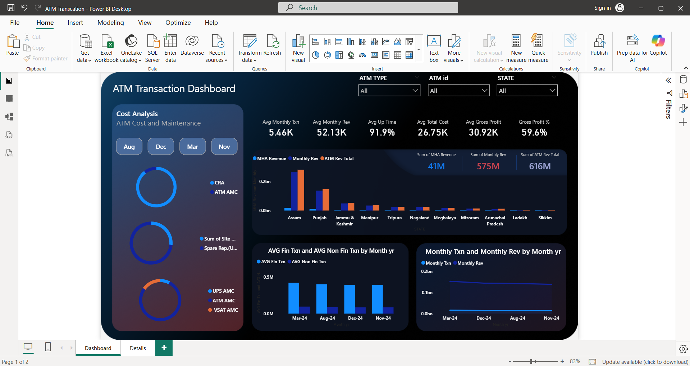
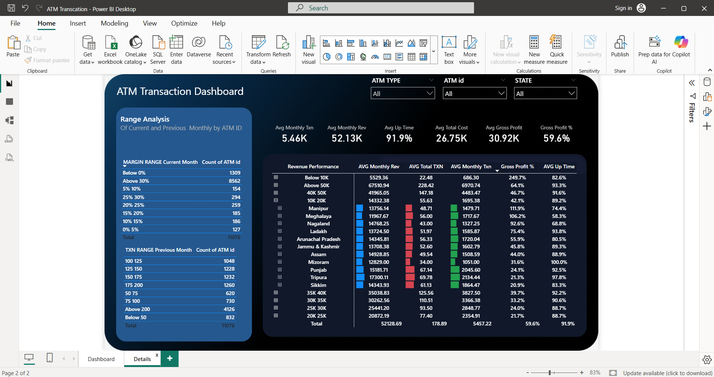

# ATM Transaction Analysis

## Business Question
When do customers use ATMs most, and which
locations need better service availability?

## Tools Used
Power BI | Excel

## Dataset
Bank of Baroda ATM transaction data —
transaction volume, revenue, uptime by location

## Key Findings
- [Open your dashboard and add peak hour here]
- [Add top performing state/location here]
- [Add revenue or transaction volume number here]

## Dashboard

## Files
- atm_transaction_analysis.pbit — [Power BI file](https://github.com/sandeep-sandy123/ATM-Transaction-Analysis-PowerBI/blob/main/aatm_transaction_analysis.pbit)
- BOB_Source.xlsx — [source data](https://github.com/sandeep-sandy123/ATM-Transaction-Analysis-PowerBI/blob/main/BOB_Source.xlsx)
- Columns Names.md — data dictionary
